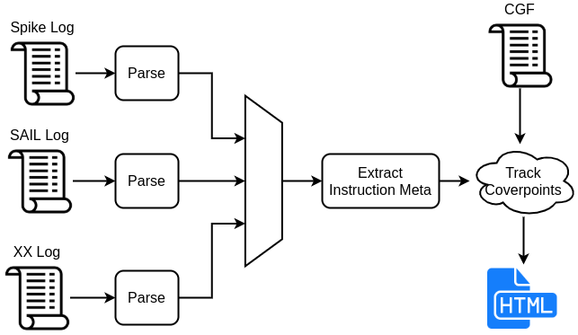

.. See LICENSE.incore for details

########
Overview
########

RISC-V ISAC is an ISA coverage extraction tool. Given a set of coverpoints and an execution trace of
a test/application run on a model, ISAC can provide a report indicating in detail which of those
coverpoints were covered by the test/application. ISAC also holds the capability to provide a
detailed quality analysis on data propagation occurring within the test/application. 
The figure below shows the overall flow of RISCV-ISAC.

.. _fig-isac:

RISCV-ISAC is primarily split into 2 major parts: the front-end parser and the backedn coverage
analyser. This split enables RISCV-ISAC to support parsing of multiple different execution log
formats and provide the same level of coverage and QA support.

The following sections will provide details on the working and flow of both these modules.

Parser-Module
=============

The parser-module is designed to parse an execution log to extract information on a per instruction
commit basis. The execution logs must contain the following information:

- Every instruction that was committed/executed by the model (can be ISS or RTL) should be captured
  as an entry in the log in the order which they were committed.
- Each instruction entry must include the program counter pointing to the begining of that
  intruction
- Each instruction entry must include the hex encoding of the instruction that was
  committed/executed. 
- Each instruction entry must also include any architectural state update occuring due to the
  execution of that instruction. For eg, the destination register that was updated, the csr that was
  modified, mem regions that were written to, etc.
- Each instruction entry can span multiple lines
- Mnemonics of the instruction is possible, should be provided as well.

Given an execution trace adhering to the above format, the parser-module is capable of deducing and
extracting the information to into a common instruction class object which contains all the
necessary information of the instruction. This object is then passed onto the coverage-module for
coverpoint analysis.

With the parser-module being decoupled from the coverage, support for parsing different execution
trace formats can be easily integrated into RISCV-ISAC.

Currently the execution traces from the following RISC-V Models is support

- SAIL: Generate a trace using the ``-v`` flag
- SPIKE: Generate a trace using ``--log-commits`` flag

See :ref:`add_parser` to know how to add your custom trace support to RISCV-ISAC.

Coverage-Module
===============
